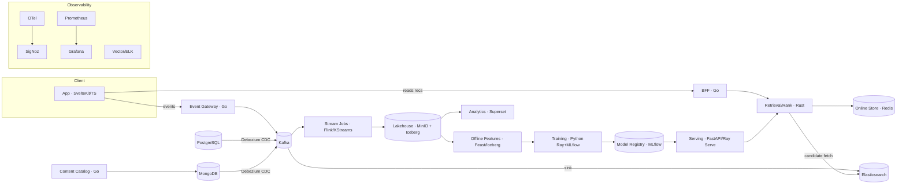

# Context Map

Bounded contexts of the content-personalization pipeline and the ubiquitous language of this workspace. This file is the root hub and the **only** context doc at root: until code lands, every context lives here; when `platform/` exists, each module owns a `CONTEXT.md` beside its code (Tribal convention). All of it stays live with reality — update atomically (`.agents/rules/keep-docs-alive.md`).

The complete product and platform vision is recorded in [`docs/agents/architecture/north-star.md`](docs/agents/architecture/north-star.md); this map remains the canonical vocabulary and bounded-context reference.

---

## 1. Bounded Contexts

| Bounded Context | Scope & Responsibility | Language | Home | Status |
|:---|:---|:---|:---|:---|
| **Event Gateway** | Ingest impressions/clicks/dwells at the edge; validate against schema; produce to Kafka; back-pressure + rate limits | Go | `platform/services/event-gateway` | live on THINKBOOK |
| **CDC** | PostgreSQL and MongoDB change-data-capture into Kafka topics | Debezium (config) | `platform/infra/cdc` | live on THINKBOOK via Strimzi KafkaConnect |
| **Stream Processing** | Validate, enrich, aggregate event streams; write to lakehouse; one Kafka Streams service for lightweight enrichment | Java (Flink job + one KStreams svc) | `platform/streaming` | live on THINKBOOK k3s (embedded, parallelism 1) |
| **Lakehouse** | MinIO objects + Iceberg tables: bronze/silver/gold events | SQL + engine-managed | `platform/lakehouse` | raw Iceberg landing live on k3s; bronze/silver/gold reserved |
| **Feature Platform** | Feast registry; independent user/item Iceberg-to-Parquet views; Dask point-in-time joins; seven-day Redis online keys | Python | `platform/features` | implemented; live-proven against k3s stores |
| **Content Catalog** | Canonical recommendable content-item documents and active reads | Go + MongoDB | `platform/services/content-catalog` | implemented; MongoDB reads and CDC live-proven on k3s |
| **Training** | Ray Train/Tune pipelines, experiment tracking, model promotion | Python | `platform/training` | reserved |
| **Serving** | Model inference behind FastAPI/Ray Serve; candidate generation inputs | Python | `platform/serving` | reserved |
| **Retrieval/Rank hot path** | Candidate fetch from Redis/Elasticsearch, feature-vector join, light scoring under strict tail-latency budget | Rust | `platform/services/retrieval` | reserved |
| **BFF** | App-facing API composing profile + recs; session handling | Go | `platform/services/bff` | reserved |
| **App** | Personalized feed UI emitting interaction events | SvelteKit/TS | `platform/app` | reserved |
| **Observability** | Traces/metrics/logs via OTel → SigNoz; Prometheus/Grafana; Vector or ELK logs | config + SDKs | `platform/observability` | reserved |
| **Analytics** | Superset dashboards over lakehouse/DWH | config | `platform/analytics` | reserved |

## 2. Domain Relationships & Boundaries

1. The **event loop is the spine**: the App emits interactions → Gateway → Kafka → lakehouse → features → models → better recommendations → back to the App. Every context serves that loop.
2. Contexts communicate only through contracts (OpenAPI, Avro/JSON Schema, Iceberg schemas) — never shared libraries across languages ([ADR 0004](./docs/adr/0004-polyglot-language-per-concern.md)).
3. **Retrieval** is the only component allowed to touch both Redis and Elasticsearch directly at request time; everything else goes through owned APIs.
4. Training reads features only through **Feast** (point-in-time joins), never by ad-hoc querying Iceberg.
5. Infra services are chart/operator-managed on THINKBOOK and compose-managed for the MACBOOK fallback (`resource-budget` governs what runs simultaneously — [ADR 0003](./docs/adr/0003-ram-budgeted-local-infrastructure.md)).

## 3. Ubiquitous Language

- **Interaction event**: atomic user action — impression, click, dwell, like/save, share. The unit of ingestion.
- **Content item**: the canonical article/video/product document owned by MongoDB; its stable ID is carried as `item_id` in interaction events. Avoid calling the document an interaction or event.
- **Candidate retrieval**: narrowing the full catalog (~10⁴–10⁶) to hundreds of plausible items for one request.
- **Ranking**: scoring retrieved candidates by predicted relevance (CTR/consumption probability).
- **Feature vector**: the joined user × item × context features fed to ranking.
- **Online store / offline store**: Redis (low-latency lookup, latest values) vs Iceberg (historical, point-in-time correct training sets).
- **Point-in-time correctness**: training rows must contain only feature values knowable at event time.
- **Profile group**: a compose subset sized to fit RAM alongside nothing else (see `managing-mlops-services` skill).

## 4. Implemented vs Reserved (stale-trap index)

Facts, not aspirations.

**Implemented**: workspace scaffolding — context-engineering layer (AGENTS/CONTEXT-MAP/rules/skills/docs), reference clone registered with generated metadata, metadata generators. **Phase-1 data foundation live on THINKBOOK k3s** (ADR 0006/0007): Strimzi Kafka, CloudNativePG PostgreSQL, charted MongoDB and MinIO, Strimzi KafkaConnect/Debezium, Go event gateway (`POST /events` → `mlops.events.raw`), first Flink job (`event-counts`, windowed counts), and the **streaming-owned raw-event landing zone** into an Iceberg table on MinIO (`events-lake`, ADR 0008's dual pin). **Phase-2 Feature Platform seam implemented**: the `ranking_features` Feast contract, causal seven-day snapshot builder, JDBC-catalog/DuckDB Iceberg adapter, Feast Dask point-in-time retrieval, and Redis materialization are tested locally and live-proven against k3s Iceberg and Redis stores. Downstream lakehouse capabilities (bronze/silver/gold transforms) stay reserved under `platform/lakehouse`. Compose remains the low-memory authoring fallback.

**Reserved with binding decisions**: full pipeline shape above; language ownership per [ADR 0004](./docs/adr/0004-polyglot-language-per-concern.md); SvelteKit over Next.js per [ADR 0005](./docs/adr/0005-sveltekit-over-nextjs.md); RAM-profiled local infra per [ADR 0003](./docs/adr/0003-ram-budgeted-local-infrastructure.md); k3s + Helm adoption per [ADR 0007](./docs/adr/0007-kubernetes-adoption-k3s-helm.md).

**Not built**: training, serving, app layer, observability, and analytics. Current phase state in [`.worklog/FOCUS.md`](./.worklog/FOCUS.md) (local-only).

## 5. Engineering Contexts

| Location | Guide | Purpose |
|:---|:---|:---|
| [`AGENTS.md`](./AGENTS.md) | §1 mapping | Instruction hierarchy, principles, commands. |
| [`.worklog/FOCUS.md`](./.worklog/FOCUS.md) | root (local-only) | Current phase, active threads, handoff notes. |
| `.agents/rules/` | mapped in AGENTS.md §1 | Operational rules with frontmatter (`globs`, `alwaysApply`). |
| `.agents/skills/` | mapped in AGENTS.md §1 | Phase workflows: study, operate. |
| `docs/adr/` | [`docs/AGENTS.md`](./docs/AGENTS.md) hub | Binding decisions with alternatives. |
| `docs/agents/` | `knowledge/` + `runbooks/` + `experiments/` + section map + generated `index.json` | Agent-facing docs: transferable knowledge, executable procedures, experiment records. |
| `.notes/00-roadmap.md` | roadmap | Phase plan and stack map (local-only). |
