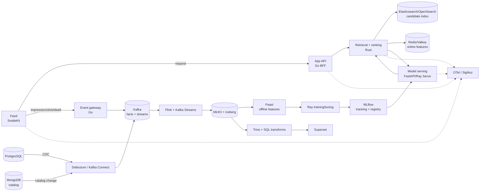

# System Flow — Runtime and Data Movement

This page answers one question: how does a user interaction become a recommendation and then create the next training signal?

## Target topology

## Request path

1. The SvelteKit app asks the Go BFF for a feed.
2. The BFF calls the Rust retrieval/ranking service through a stable contract.
3. Retrieval narrows the catalog, joins online features, invokes the model, and returns ranked candidates.
4. The BFF shapes the app response without exposing Redis, the search index, or model internals.
5. The app emits impressions and later engagement events to the Go event gateway.

## Data path

1. The gateway validates and keys interaction events by `user_id` before producing them to Kafka.
2. Debezium publishes database changes into separate CDC topics; a CDC record is not the same domain object as an app interaction.
3. Flink handles event-time validation, late data, enrichment, windows, and aggregates; Kafka Streams handles lightweight enrichment.
4. The raw stream lands in Iceberg on MinIO before downstream transformations derive analytical and feature datasets.
5. Feast exposes the same feature definitions for point-in-time offline training and low-latency online serving.

## Control path

Training, evaluation, model promotion, feature materialization, and candidate-index rebuilds are control-plane workflows. They may use RabbitMQ, Temporal, Dagster, or another orchestrator, but their lifecycle facts belong in MLflow, Kafka, or durable tables—not only in a transient queue.

## Deployment path

Compose is the resource-budgeted development venue. k3s and Helm are the target deployment surface after the Phase 1 boundary, with stateful infrastructure managed deliberately and owned services using small charts.

## Read next

- [Messaging](./messaging.md) for facts versus commands.
- [Data platform](./data-platform.md) for source, lakehouse, and query choices.
- [ML platform](./ml-platform.md) for features, training, evaluation, and serving.
- [Operations](./operations.md) for runtime and production concerns.
